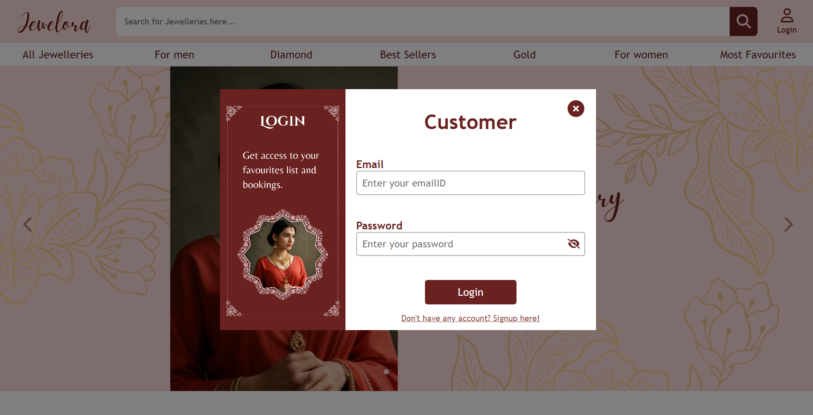
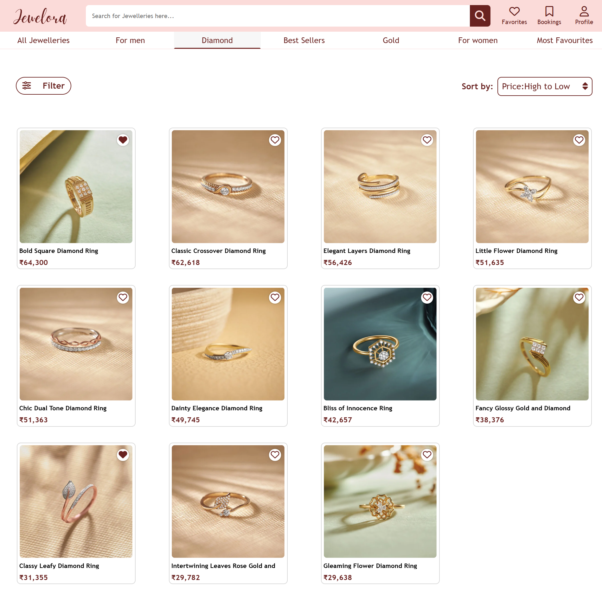
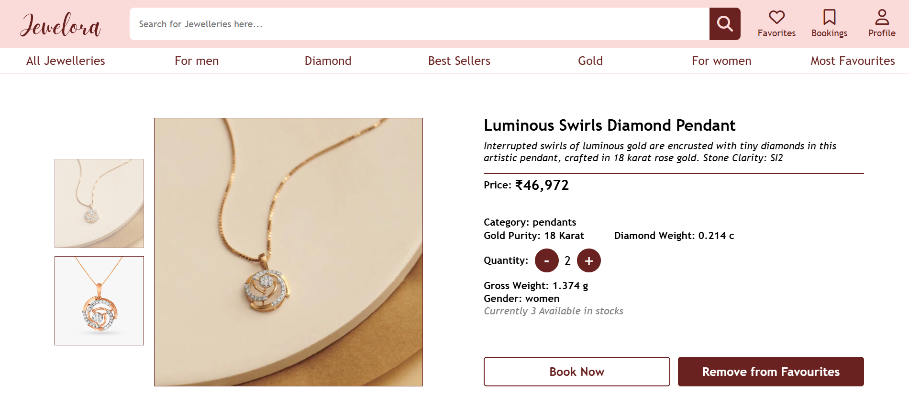
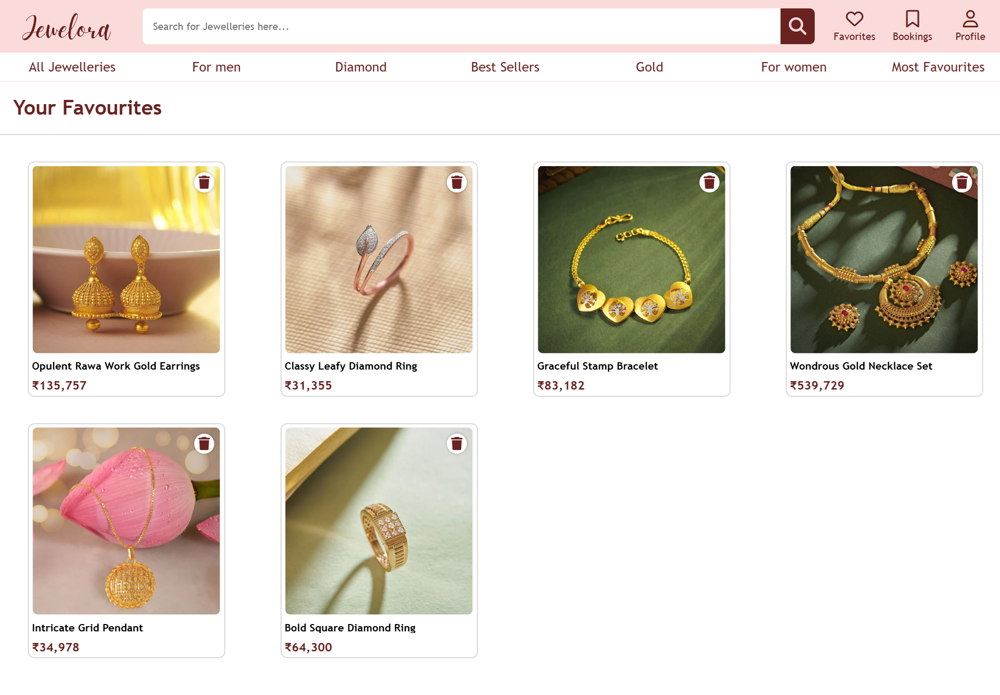
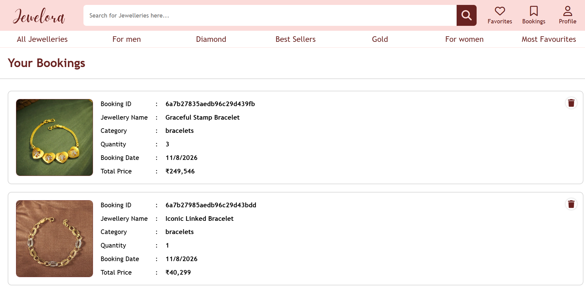
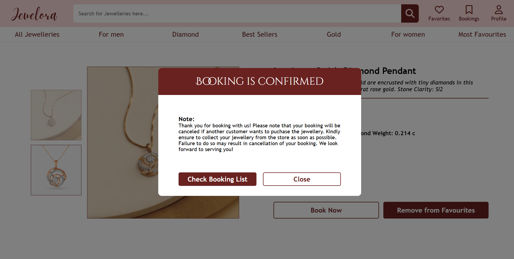
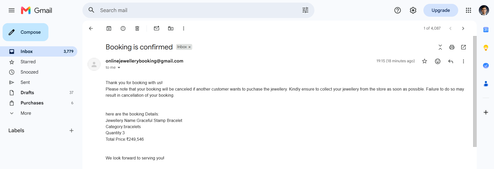
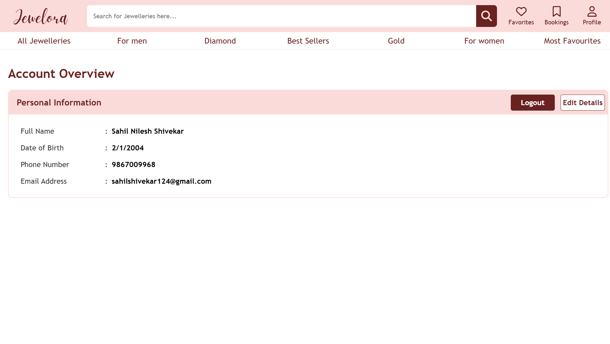
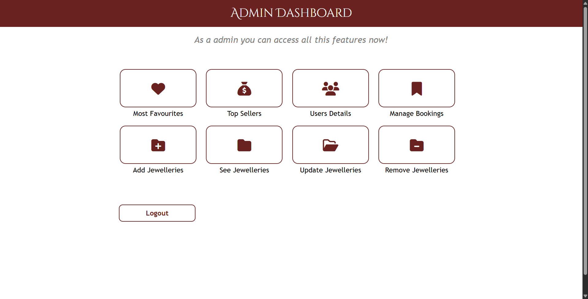

# 💍 Jewelora

**Jewelora** is an end-to-end web application for **browsing, discovering, and booking jewellery online**.

The project provides a complete jewellery shopping experience with a **customer-facing storefront** and a **dedicated admin panel** for managing jewellery, users, and bookings.

---

## ✨ Features

### 👤 Customer

- 🔐 User registration, login, and profile management
- 🏠 Browse featured and categorized jewellery
- 🔎 Search, filter, and sort jewellery
- 💎 View detailed jewellery information and availability
- ❤️ Manage favourite jewellery
- 📅 Book jewellery with selectable quantities
- 📋 View and manage bookings
- 📧 Receive booking confirmation emails

### 🛠️ Admin Panel

- 📊 Admin dashboard with sales and favourite insights
- 💎 Manage jewellery — add, view, update, and remove
- 👥 View and manage users
- 📋 Manage customer bookings

---

## 🖥️ Screenshots

### 🏠 Home Page

The home page provides a jewellery-focused storefront with featured jewellery, categories, best sellers, and gender-based browsing.


---

### 🔐 Login

User authentication screen for accessing the customer account.




---

### 💎 Jewellery Listing

Browse jewellery products with filtering and sorting options.




---

### 🔍 Jewellery Details

Detailed product page showing jewellery images, price, category, purity, weight, quantity, gender, availability, and booking options.




---

### ❤️ Favourites

Customers can save jewellery they are interested in and manage their favourite list.




---

### 📅 Bookings

Customers can view their bookings along with booking ID, jewellery details, quantity, booking date, and total price.




---

### ✅ Booking Confirmation
A confirmation dialog is displayed after successfully booking jewellery.




---

### 📧 Booking Confirmation Email
Customers receive an email containing their booking details and important booking information.




---

### 👤 Profile

Account overview showing personal information with options to edit details or log out.




---

## 🛠️ Admin Panel

### 📊 Admin Dashboard

The admin dashboard provides access to jewellery management, users, bookings, favourites, and sales-related information.




---

## 🏗️ Tech Stack

### Frontend

- **EJS** — Embedded JavaScript Templates
- **CSS3**
- **JavaScript**

### Backend

- **Node.js**
- **Express.js**

### Database

- **MongoDB**
- **Mongoose ODM**


---

## ⚙️ Getting Started

### 1. Clone the repository

```bash
git clone <https://github.com/sahilshivekar/jewelora>
```

### 2. Install dependencies

```bash
npm install
```

### 3. Configure environment variables

Create a `.env` file in the project root and add the required configuration, for example:

```env
MONGO_URI=<your-mongodb-connection-string>
```

Add any other environment variables required by the application.

### 4. Start the application

```bash
npm run dev
```

The application will then be available at the configured local server URL.

---

## 🔄 Application Flow

```text
Customer
   │
   ├── Register / Login
   │
   ├── Browse Jewellery
   │      ├── Search
   │      ├── Categories
   │      ├── Filters
   │      └── Sorting
   │
   ├── View Jewellery Details
   │
   ├── Add to Favourites
   │
   └── Book Jewellery
          │
          ├── Booking Saved
          ├── Booking Listed in Account
          └── Confirmation Email Sent


Admin
   │
   └── Admin Dashboard
          ├── Manage Jewellery
          ├── Manage Users
          ├── Manage Bookings
          ├── Most Favourites
          └── Top Sellers
```

---

## 📌 Future Improvements

- 💳 Online payment integration
- 📦 Order and delivery tracking
- ⭐ Jewellery reviews and ratings
- 🔔 Real-time booking notifications
- 📱 Improved mobile responsiveness
- 📈 Advanced admin analytics
- ☁️ Production deployment with cloud storage for jewellery images

---


## ⚠️ Technical Note

This repository was developed during a period where my primary focus was shifting toward **Mobile App Development**. As a result:

- The codebase contains **legacy practices**
- Some architectural patterns may appear **messy or inconsistent**
- Clean code principles were occasionally deprioritized in favor of **rapid feature implementation**

This project has been intentionally preserved in its **original state** as a **developer log**, representing:
- My learning journey
- The logic-building phase of my career
- Real-world experimentation and growth

> ⚠️ This repository does **not** represent my current standard for production-grade, maintainable, or scalable code.